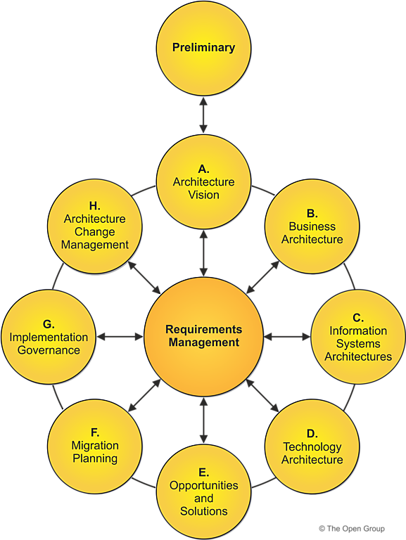
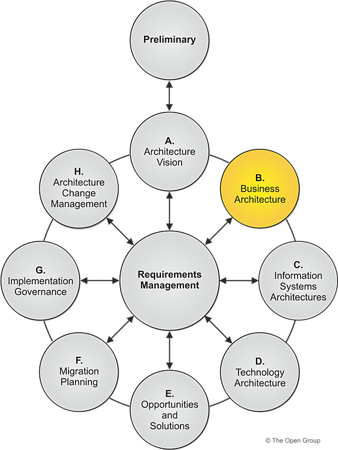
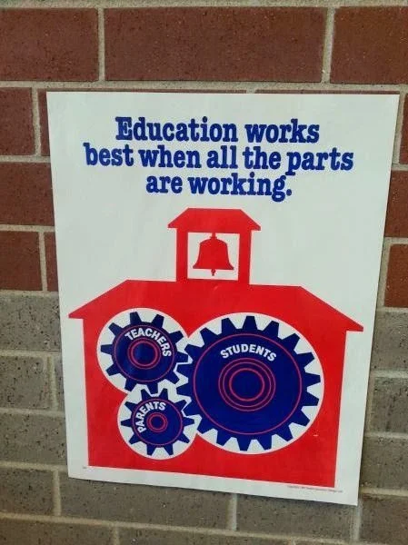
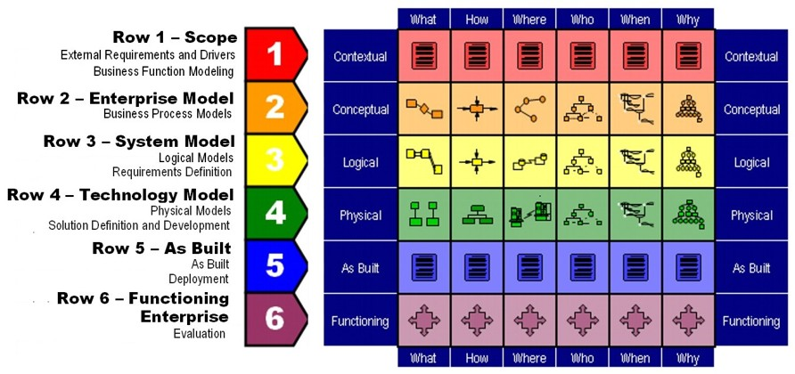
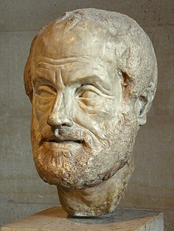
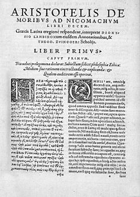
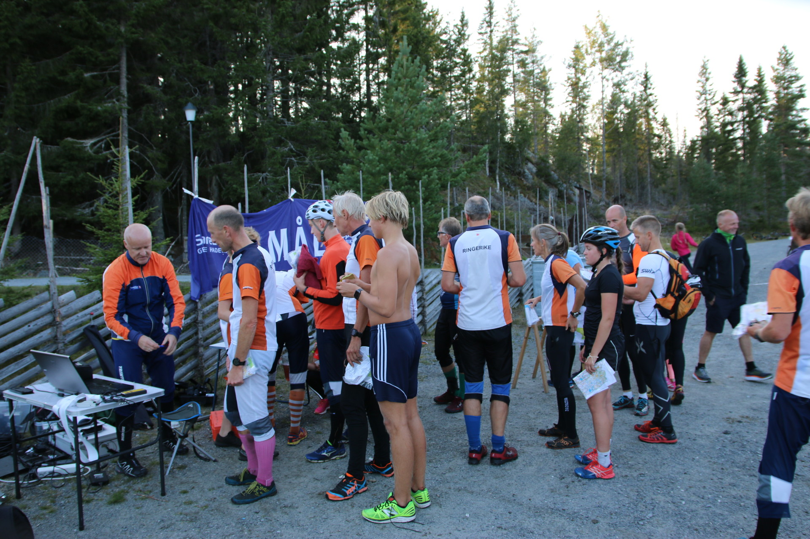
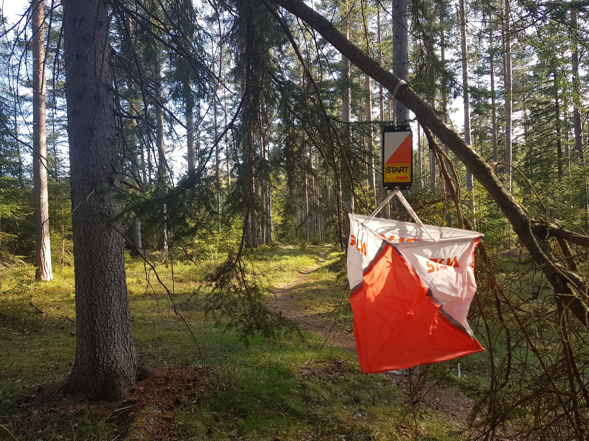
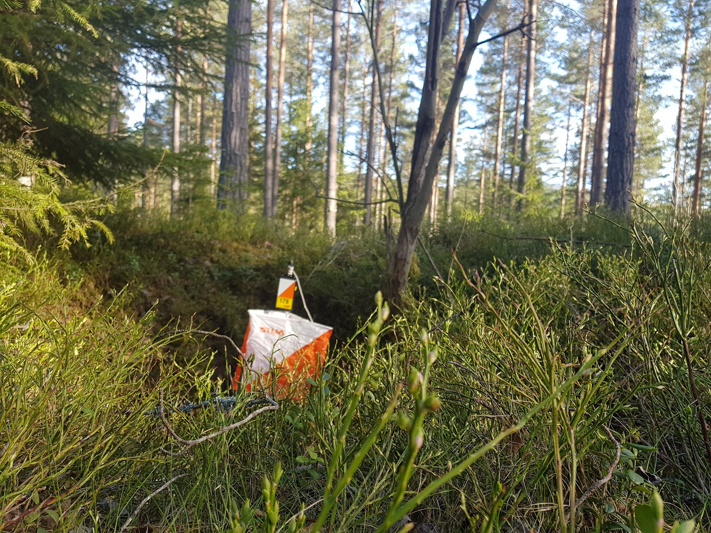
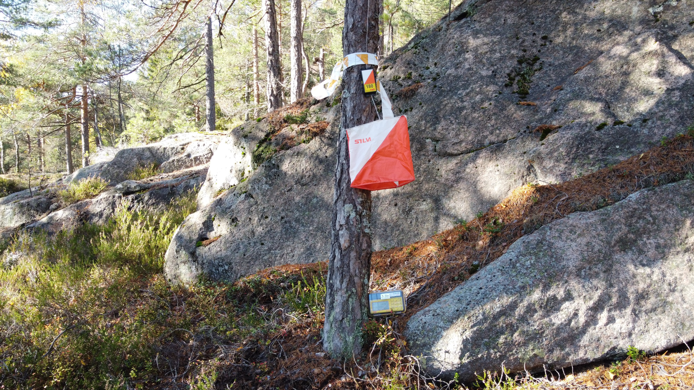

## 

---

## Jeg har syndet

---

## Det må da finnes en teknikk som kan hjelpe meg?

---

## Togaf


<section data-auto-animate>
  <div class="r-stack">
    
    
    
  </div>
  <a href="https://pubs.opengroup.org/togaf-standard/index.html">The Open Group Architectural Framework</a>
</section>

---

## Zackman Framework



---

## Aristoteles
  
  

  <a href="https://en.wikipedia.org/wiki/Five_Ws">Hvem, hva, hvorfor, hvordan, hvor og når</a>

---

<section data-auto-animate>
<h2 data-id="header">Mellings-metode</h2>
  <div class="r-stack">
  </div>
</section>

<section data-auto-animate>
<h2 data-id="header"><s>Mellings-</s>metode</h2>
  <div class="r-stack">
    
    
    
    
    
    
  </div>
</section>

---

## 

<section data-auto-animate>
  <div class="r-stack">
    <h2 class="fragment fade-in-then-out">The domain...</h2>
    <h2 class="fragment fade-up-then-out">Orientering</h2>
    
    
  </div>
</section>

---

## Aktører

<section data-auto-animate>
<ul>
  <li>Norges Orienteringsforbund</li>
  <li>Deltager</li>
  <li>Tilskuer</li>
  <li>Løpsleder</li>
  <li>Startleder</li>
  <li>Premieansvarlig</li>
  <li>Saftutdelere</li>
  <li>...</li>
</ul>
</section>
<section data-auto-animate>
<ul>
  <li>Tilskuer</li>
  <li>Saftutdelere</li>
</ul>
</section>


---

## Målsetning

<section data-auto-animate data-auto-animate-easing="cubic-bezier(0.770, 0.000, 0.175, 1.000)">
    <p align="left" class="fragment fade-in-then-semi-out">Tilskuer</p>
    <p align="left" class="fragment fade-up">- Være klar til å heie når favorittene nærmer seg mål</p>
    <p align="left" class="fragment fade-up ">- Komme seg hjem så fort som mulig</p>
    <p align="left" class="fragment fade-in-then-semi-out">Saftutdeler</p>
    <p align="left" class="fragment fade-up">- Ferdig blandet saft til alle når de kommer i mål</p>
    <p align="left" class="fragment fade-up">- Ikke sløse med sportsdrikken</p>
</section>

---

## Begrep
<section data-auto-animate>

```plantuml
skinparam backgroundColor transparent
skinparam monochrome reverse
skinparam handwritten true
object klasse
object deltager 
object klubb

deltager "*"-"1" klubb
deltager "*"-up-"1" klasse
```

</section>

<section data-auto-animate>

```plantuml
skinparam backgroundColor transparent
skinparam monochrome reverse
skinparam handwritten true
object klasse
object deltager 
object klubb
object løype
object post

deltager "*"-"1" klubb
deltager "*"-up-"1" klasse
klasse "*"-left-"1" løype
løype "1"--"*" post

```

</section>

<section data-auto-animate>

```plantuml
skinparam backgroundColor transparent
skinparam monochrome reverse
skinparam handwritten true
object klasse
object deltager 
object klubb
object løype
object post
object postenhet
object brikke
object meldestasjon

deltager "*"-"1" klubb
deltager "*"-up-"1" klasse
klasse "*"-left-"1" løype
løype "1"--"*" post
post "*"--"1" postenhet
postenhet "*"-"*" brikke
brikke "1"-up-"1" deltager
postenhet "1"--"0..1" meldestasjon
```

</section>

---

## Postenhet

<section data-auto-animate>
  <div class="r-stack">
    
    
    
  </div>
</section>

---

### Regler

> Være klar til å heie når favorittene nærmer seg mål

Ha en postenhet med mellomtidsstasjon som fellespost for alle løyper mellom 200 og 500 m før mål

<section data-auto-animate>
  <div class="">
    
  </div>
</section>


---

## Stemplingsprosessen

```plantuml
skinparam backgroundColor transparent
skinparam monochrome reverse
skinparam handwritten true
hide footbox

actor deltager
participant brikke
participant postenhet
participant meldestasjon
database "emittiming" as dbe
deltager -> brikke 
activate brikke
brikke -> postenhet : "stempling"
activate postenhet
postenhet --> brikke: postkode + tid
deactivate brikke
postenhet -> meldestasjon: brikkenummer\n + tid + postkode
deactivate postenhet
activate meldestasjon
meldestasjon -> dbe : last opp til server
deactivate meldestasjon

```
  <div>
    <a href="http://emittiming.no/">emittiming</a>
    <a href="https://eventor.orientering.no/Events/Show/11848">eventor</a>
  </div>

---

<section>
  
</section>

---

## Regler
> Ferdig blandet saft til alle når de kommer i mål

entry = antall påmeldinger

additional = antall etteranmeldte 

dns = antall ikke started

fin = antall i mål
<section>
\[\begin{aligned} rest = entry + additional - dns - fin
\end{aligned} \]
</section>

---

## Regler

> Komme seg hjem så fort som mulig

* Gjennomføre premieutdeling så fort premiefordelingen er klar
* Premieutdelingen kan starte før alle løpere i en klasse er i mål
* I klassene der det ikke er rangering så kan deltagere hente premie fortløpende

---

<section>
  
</section>
